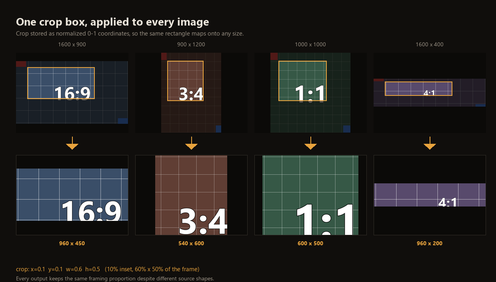

# Batch Image Tool 🖼️

A local web tool for batch image processing. Set up a crop once — with the drag-and-resize feel of a phone photo album — then apply that same operation to every image in the batch and export them all at once.

Built for the repetitive case: trimming the same margins off a set of screenshots, cropping a folder of photos to a uniform 1:1 and downscaling them, fixing the orientation on pictures that came out sideways.




## Features

- **Drag-to-crop** — resize from any of the four corners, drag the box to move it, or drag on empty canvas to draw a new one. Rule-of-thirds guides included.
- **Aspect ratio lock** — Free / 1:1 / 4:3 / 3:4 / 16:9 / 9:16. Resizing holds the ratio exactly.
- **Rotate and flip** — 90° left, 90° right, horizontal, vertical. The crop box rotates with the image, so it keeps framing the same content.
- **Batch apply with per-image overrides** — settings are identical across the batch by default. Hit *Apply to all* to push them out, or fine-tune a single image; adjusted images get a dot in the filmstrip so you can see at a glance which ones you touched.
- **Filmstrip preview** — every thumbnail draws the crop box over it in real time, so you can confirm the same settings land correctly on differently shaped images before exporting.
- **Export options** — JPG / PNG / WEBP with adjustable quality, plus three resize modes: keep cropped size, cap the long edge, or force an exact width × height.
- **Batch export** — everything is packaged into a single ZIP with a per-image `report.txt`. One bad file does not abort the batch.

## How It Works

The crop box is stored as **normalized coordinates** (0–1 relative to the rotated frame), not absolute pixels. That is what lets one rectangle map onto images of any size — a 1600×400 and a 500×500 image both get the same *proportional* region of their own frame.

Each image is processed in a fixed order:

```
rotate / flip  →  crop  →  resize  →  save
```

Because the crop is proportional rather than pixel-based, a batch with very different compositions (subject centered in one, off in a corner of another) will need a look at the filmstrip to confirm each one landed right — and a per-image nudge where it didn't.

## Quick Start

Requires Python 3.9 or newer.

```bash
# Clone the repository
git clone https://github.com/TansyZenix/Batch-Image-Tool.git
cd Batch-Image-Tool

# Install dependencies
pip install -r requirements.txt

# Run
python app.py
```

Then open <http://127.0.0.1:5000> in your browser.

## Usage

1. Click **Select images** in the top right, or drag image files anywhere onto the page. JPG, PNG, WEBP, BMP, TIFF and GIF are supported; multi-select works.
2. Drag the crop box on the canvas to the region you want. Pick an aspect ratio preset first if you need one locked.
3. Use the **Transform** buttons to rotate or flip if needed.
4. Click **Apply to all** to push the current settings across the whole batch.
5. Glance down the filmstrip and check where the crop box lands on each image. Switch to any image that needs it and adjust it individually.
6. Choose format, quality and size under **Export**, then click **Export all** and download the ZIP.

## Settings

| Setting | Description |
| --- | --- |
| Aspect ratio | On *Free*, dragging is unconstrained. Once a ratio is picked, dragging always preserves it. Switching ratios reshapes the current box to that ratio, roughly preserving its area and center. |
| Resize — keep cropped size | Outputs at the exact pixel size left after cropping. |
| Resize — long edge | Scales the long edge to the given pixel count, proportionally. This **normalizes size, so smaller images are scaled up too.** |
| Resize — exact width × height | Stretches to the given dimensions; images with a different ratio will distort. |
| Quality | Applies to JPG and WEBP only. PNG is saved losslessly. |
| Apply to all | Pushes the current settings to every image and clears the per-image override flags. |
| Reset current | Restores the current image to the default settings. |

The **Output size** readout predicts the exported dimensions using the same rounding the backend uses, so it normally matches the real output exactly.

## Project Structure

```
Batch-Image-Tool/
├── app.py                  Flask backend: upload, export, ZIP download
├── processor.py            Image pipeline: rotate, crop, resize, save
├── requirements.txt
├── LICENSE
├── README.md
├── README.zh-CN.md         中文说明
├── docs/
│   └── batch-crop-demo.png README illustration
├── templates/
│   └── index.html          Page structure
├── static/
│   ├── css/style.css       Styles
│   └── js/app.js           Frontend: crop interaction, batch apply, export
├── uploads/                Uploaded originals, per session (created at runtime)
└── outputs/                Processed results (created at runtime)
```

`uploads/` and `outputs/` are runtime directories and are git-ignored. The app creates them on demand.

## API

| Method | Path | Description |
| --- | --- | --- |
| GET | `/` | Main page |
| POST | `/api/upload` | Upload a batch; returns a session id, filenames and original dimensions, plus any skipped files |
| GET | `/api/image/<session>/<filename>` | Serve an original for canvas rendering and crop preview |
| POST | `/api/export` | Process every image with its own settings; returns per-image results and a download URL |
| GET | `/api/download/<session>` | Package the results into a ZIP |
| POST | `/api/reset/<session>` | Delete a session's uploads and outputs |

Export request body:

```json
{
  "session": "session id",
  "ops": {
    "photo.jpg": {
      "crop": { "x": 0.1, "y": 0.1, "w": 0.6, "h": 0.5 },
      "rotate": 90,
      "flipH": false,
      "flipV": false
    }
  },
  "output": {
    "format": "jpg",
    "quality": 92,
    "resize": { "mode": "long_edge", "value": 1600 }
  }
}
```

## Notes and Limitations

- **The server listens on `127.0.0.1` only and has no authentication.** It is a local single-user tool running on the Flask development server — do not expose it to the internet.
- **The interface is in Chinese.** The backend and API are language-neutral.
- **Selecting images replaces the whole batch.** Settings from the previous batch are not kept.
- **Uploaded originals stay in `uploads/`** and results in `outputs/`. Starting a new batch clears the previous session automatically; you can also just delete both folders.
- **EXIF orientation is applied automatically** (photos display and export the right way up), but the exported files do not carry EXIF data forward.
- **Size limits:** about 400 megapixels per image, 2 GB per upload.

## License

Released under the MIT License. See [LICENSE](LICENSE).
